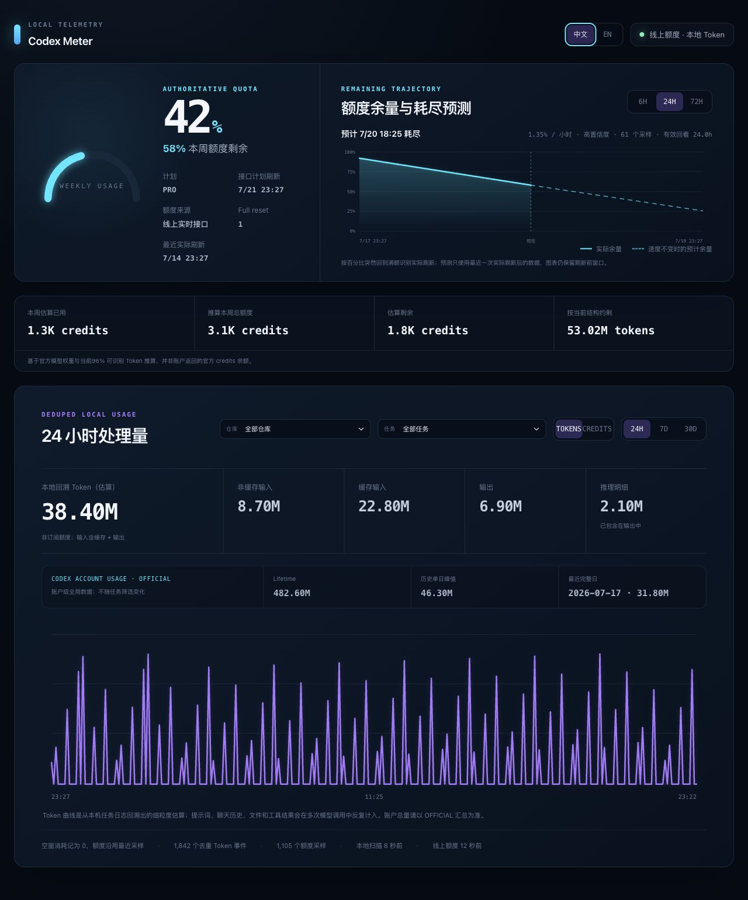

# Codex Meter

[](LICENSE)
[](package.json)

**A privacy-first, local dashboard that makes Codex quota, raw tokens, credits,
refreshes, and exhaustion forecasts understandable.**

Codex 本地额度与用量看板。持续记录当前额度、实际刷新、Token/Credits 消耗和
预计耗尽时间；Token 可回溯至本机仍可读取的最早任务，断网时停止打点，恢复联网后自动继续。



> 非 OpenAI 官方项目。依赖的 Codex app-server 账户接口可能随 Codex 更新发生变化。

## 为什么需要它

Codex 的“用量”并不是一个单一数字：

- **Quota、原始 Token、Credits 是三种口径。** 长对话、文件和工具结果会在多轮
  调用中重复进入上下文，缓存输入仍算 Token，却按更低的 Credits 权重计价。
  因此数亿原始 Token 不等于同等规模的订阅额度消耗。
- **当前快照无法回答趋势问题。** Codex 可以显示当前剩余量，但很难直接看到完整
  本地历史如何变化、按现在速度何时耗尽，以及某一个 Codex 任务究竟消耗了多少。
- **计划刷新与实际刷新可能不一致。** 接口给出的计划时间不是唯一事实来源；额度
  也可能在其他时间突然回到 100%。Codex Meter 会根据真实百分比跳变记录刷新，
  同时保留刷新前窗口。
- **网络并不总是在线。** 离线期间伪造采样会污染预测；本项目离线不打点，恢复后
  自动续采，并在展示时对额度和消耗采用明确的空窗规则。

## 功能亮点

- **权威额度 + 本地历史：** 在线 quota 作为当前额度基准，本机会话事件负责历史
  回溯与离线兜底。
- **真实刷新轨迹：** 自动识别额度突然回满，刷新前后折线分段、垂直刷新线保留，
  不会被陈旧点制造二次回摆。
- **耗尽预测：** 可切换 6/24/72 小时观察窗口，使用最近一次真实刷新后的样本做
  线性回归，并在曲线上标出预计 `0%` 的具体时间。
- **可交互点位：** 悬停额度曲线可查看实际/预测点位的时间、剩余和已用百分比。
- **仓库与任务下钻：** Token 与 Credits 支持“全部 / 仓库 / 单个任务”切换；
  选择器只展示用户创建的顶层任务，Sub-agent 用量自动归入调用它的父任务，并用
  一个始终可见的独立数值标出当前筛选范围内、已计入总量的 Sub-agent Token。
  账户官方汇总始终保持全局口径。
- **可靠的仓库归属：** 有 Git remote 时显示仓库 slug；无 remote 时向上寻找
  `.git` 根目录并显示完整绝对路径，Codex 临时工作区也不会只剩 `w`、`wo` 之类
  无法辨认的尾目录。
- **中英文界面：** 前端可在中文与 English 之间即时切换，选择仅保存在浏览器本地。
- **Token 口径拆解：** 分别展示非缓存输入、缓存输入、输出与推理明细，并把官方
  账户日汇总与本地分钟级估算明确分开。
- **全部本地历史：** Token/Credits 不再受 30 天窗口限制，首次升级会自动重建索引，
  回填本机仍可读取的最早任务；仍可切换 24H / 7D / 30D / ALL 查看不同粒度。
- **离线友好：** 离线不打点，恢复后自动继续；额度空窗沿用最近值，Token/Credits
  空窗记为 0，曲线不断裂。额度采样独立保留最近 30 天。

## 一条命令运行

需要 Node.js `>=22.13.0`。

```bash
npx --yes github:LRRuan/codex-meter
```

打开 `http://localhost:3000`。命令会安装并同时启动看板与本地采集器，历史数据库
默认持久化到 `~/.codex-meter/codex-meter.sqlite`。按 `Ctrl+C` 停止。

从源码开发：

```bash
git clone https://github.com/LRRuan/codex-meter.git
cd codex-meter
npm install
npm run dashboard
```

源码模式的数据库默认位于项目 `.data/codex-meter.sqlite`。

## 数据说明

- 额度百分比与刷新时间优先来自 Codex app-server 的在线额度接口；任务日志事件作为历史回溯与离线兜底。
- Codex 官方定义中，**Thread（任务）** 是包含多个 Turn 的可恢复对话历史，**Turn（轮次）** 是一次用户输入触发的执行。本项目按用户创建的顶层 Thread 做用量筛选，不进一步细分到 Turn；Sub-agent Thread 根据本地 `parent_thread_id` 递归归入顶层任务。
- 本地细粒度 Token 是从任务累计计数器回溯的估算，并按与模型字段无关的事件指纹跨文件去重；子任务/分叉日志即使缺失模型字段，重放的父任务历史也不会再次累计。推理 Token 只作输出明细，不会再次加入总量；账户总量以 Codex 官方账户汇总为准。
- Token 按非缓存输入、缓存输入、输出和推理明细统计，并与额度百分比使用独立图表和量纲。
- 账户级 Lifetime、单日峰值和每日 Token 汇总来自 Codex `account/usage/read`；它用于校验本地细粒度曲线，但官方接口暂不提供分钟级明细。
- Credits 按官方模型费率估算，缓存输入按缓存价计算；它不是订阅账户的官方余额。
- 实际刷新根据“已用百分比突然回到接近 0%”识别，不依赖接口计划时间；图表保留刷新前后窗口，预计耗尽只使用最近一次实际刷新后的样本做线性回归。
- 无采样时段沿用上一笔额度，区间 Token/Credits 消耗记为 0，因此曲线不会断开。
- Token 事件作为本地派生索引长期保留，并扫描 `sessions` 与 `archived_sessions` 中
  仍可读取的全部任务日志；首次从旧版本升级会自动重建一次索引。若 Codex 已删除
  某段源日志，本项目无法恢复该段历史。额度采样与 Token 历史分离，仅保留最近 30 天。
- 源码模式数据库路径默认为 `.data/codex-meter.sqlite`；单命令模式默认为 `~/.codex-meter/codex-meter.sqlite`。

可选环境变量：`CODEX_HOME`、`CODEX_METER_DB`、`CODEX_METER_PORT`、
`CODEX_METER_POLL_MS`、`CODEX_METER_LIVE_POLL_MS`。

## 隐私与安全

- 所有采集和展示都在本机完成；项目不会主动向第三方上报数据。
- 数据库、环境变量、构建产物、运行日志和本机会话内容均被 `.gitignore` 排除。
- 数据库可能包含本机任务文件路径和账户用量元数据，请勿手动提交 `.data/`、
  `~/.codex/` 内容或调试日志。
- 采集器调用本机已有的 Codex app-server 登录态，但不会把凭据写入项目数据库。
- 任务标题与仓库元数据只从本机 Codex 状态库读取；为正确区分无 remote 的本地
  仓库，界面会显示 Git 根目录或工作目录的绝对路径，但不会返回 Git remote 原文
  或任务正文，并且只允许 loopback 页面跨源访问采集器。

## 验证

```bash
npm run lint
npm test
```

## 许可证

[MIT](LICENSE)
